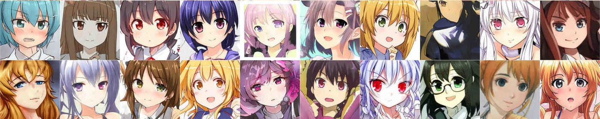

# Anime_face_generator

Welcome to the Anime Faces GAN project! In this repository, we explore the fascinating world of Generative Adversarial Networks (GANs) applied to generating anime faces. We have trained a GAN model on a dataset of 3400 anime face images, which is a very small dataset, but the results are quite satisfying. This project showcases the power of deep learning in creating stunningly realistic anime face images.

## Table of Contents

- [Introduction](#introduction)
- [Dataset](#dataset)
- [Model Architecture](#model-architecture)
- [Training](#training)
- [Results](#results)
- [Usage](#usage)
- [Contributing](#contributing)
- [License](#license)

## Introduction

Generative Adversarial Networks (GANs) are a powerful class of deep learning models that have gained significant attention in recent years. They consist of two main components, a generator and a discriminator, which work together in a competitive manner to create highly realistic data samples. In this project, we have applied GANs to generate anime faces, capturing the unique artistic style and characteristics of anime artwork.

## Dataset

We collected a diverse dataset of 3400 anime face images from various sources, carefully curated to ensure a wide range of styles and features. The dataset includes different facial expressions, hairstyles, and accessories, providing a rich training ground for our GAN model to learn from.

## Model Architecture

Our GAN architecture consists of a generator and a discriminator. The generator takes random noise as input and gradually learns to generate anime-style faces that are indistinguishable from real images. The discriminator, on the other hand, is trained to differentiate between real images from our dataset and fake images produced by the generator.

## Training

The training process involves iteratively optimizing the generator and discriminator networks. The generator aims to produce images that can fool the discriminator, while the discriminator aims to better distinguish real images from fake ones. This adversarial training process leads to the refinement of both networks over time.

Training Parameters:
- Learning Rate: 0.002
- Batch Size: 34
- Epochs: 10

## Results

After training it for around 100 epochs with suitable hyperparameter tuning, you will get amazing results, since this model is trained for just 2 epocs because of lack of computaional power and time, it is not producing that much good result. The generated images will exhibit a variety of facial expressions, hairstyles, and accessories, showcasing the versatility of the model.

/
## Usage

To use the trained GAN model for generating your own anime faces, follow these steps:

1. Clone this repository: `git clone https://github.com/shivanshu8211/Anime_face_generatoir.git`
2. Install the required dependencies: python3, torch, torchvison
3. Run the `GAN_code.ipynb`

You can customize the generation parameters and experiment with different noise inputs to produce a wide range of unique anime faces.

## Contributing

We welcome contributions to this project! If you have ideas for improvements, new features, or optimizations, please feel free to submit a pull request. For major changes, please open an issue first to discuss the proposed changes.

## License

This project is licensed under the [IITH License](LICENSE).

---

Feel free to reach out to us with any questions or feedback. Happy generating!
